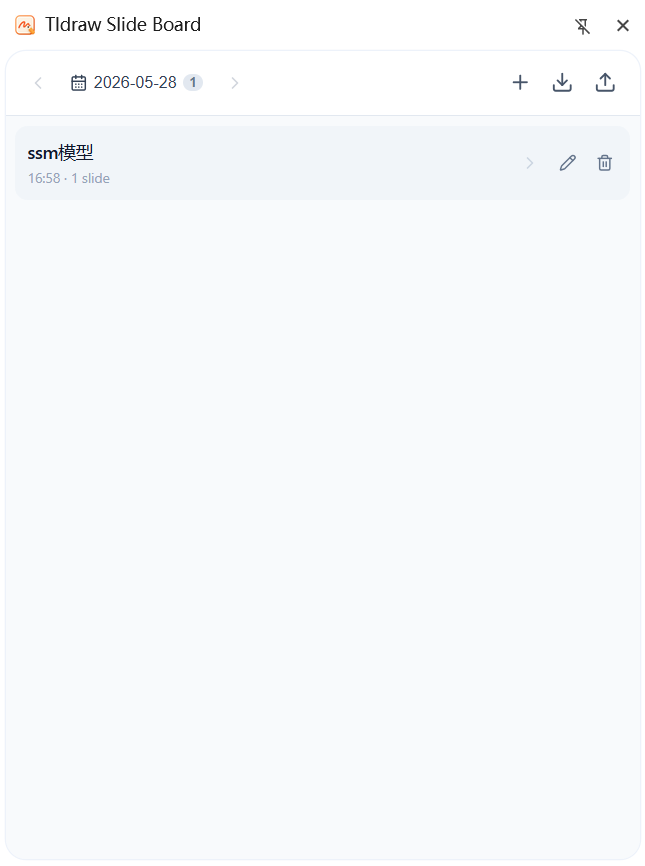
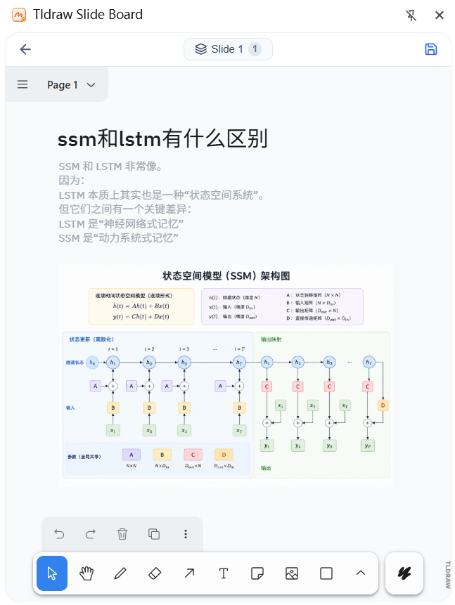

<p align="center">
  
</p>

<h1 align="center">Tldraw Slide Board</h1>

<p align="center">
  A browser extension for creating and managing slide boards powered by <a href="https://tldraw.com">tldraw</a>.
</p>

<p>
  
  
</p>

<p align="center">
  <a href="README_CN.md">简体中文</a>
</p>

---

## Features

- **Slide Mode** — Each board supports multiple slides. Create, switch, and delete slides within a single board.
- **Daily Indexing** — Boards are organized by creation date. Browse your history with a date navigation bar.
- **Inline Editing** — The tldraw canvas is embedded directly in the side panel. No extra tabs needed.
- **Auto Save** — Changes are automatically saved every 3 seconds. A manual save button is also available.
- **Title Editing** — Rename any board inline from the history list.
- **Full Import / Export** — Export all boards and slides as a single JSON file. Import with merge or overwrite mode.

## Getting Started

### Install Dependencies

```bash
npm install
```

### Development

```bash
npm run dev
```

### Build for Production

```bash
npm run build
```

### Load as Chrome Extension

1. Build the project with `npm run build`.
2. Open `chrome://extensions` in your browser.
3. Enable **Developer mode**.
4. Click **Load unpacked** and select the `dist` folder.

## Tech Stack

- [Vue 3](https://vuejs.org/) with Composition API and `<script setup>`
- [tldraw](https://tldraw.com/) — Collaborative whiteboard / canvas editor
- [Vite](https://vitejs.dev/) — Build tool
- [idb-keyval](https://github.com/jakearchibald/idb-keyval) — IndexedDB key-value storage
- [@lucide/vue](https://lucide.dev/) — SVG icon library
- [Chrome Extension Manifest V3](https://developer.chrome.com/docs/extensions/develop/migrate/what-is-mv3)

## Project Structure

```
src/
├── background/
│   └── main.ts                # Service worker (side panel & action handling)
├── shared/
│   ├── types.ts               # Data models (BoardMeta, SlideRecord, etc.)
│   └── storage.ts             # IndexedDB persistence layer
├── sidepanel/
│   ├── SidePanelApp.vue       # Main side panel (date index + board list)
│   ├── InlineEditor.vue       # Embedded tldraw editor with slide management
│   ├── DatePanel.vue          # Date navigation bar
│   ├── BoardList.vue          # Board history list with inline title editing
│   └── main.ts                # Side panel entry point
└── editor/
    ├── EditorApp.vue          # Standalone editor page (optional)
    ├── TldrawVueBridge.vue    # Vue ↔ React bridge for tldraw
    └── main.ts                # Editor entry point
```

## License

MIT
